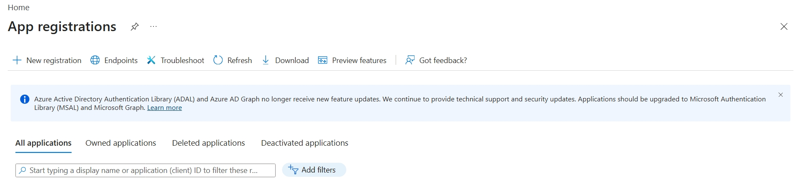
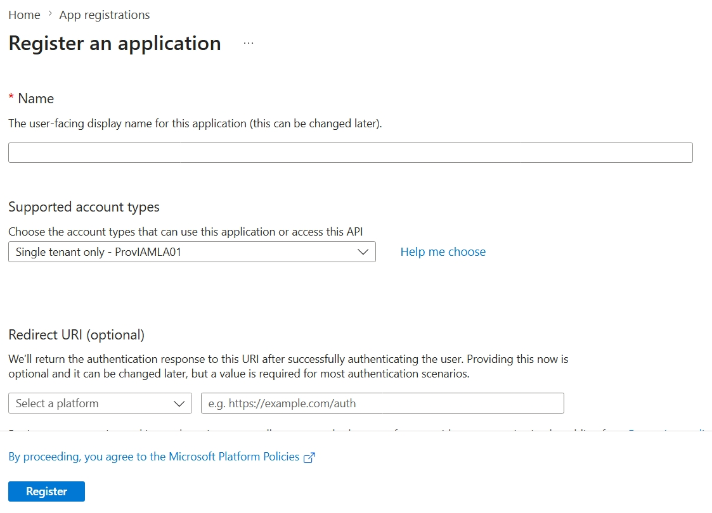
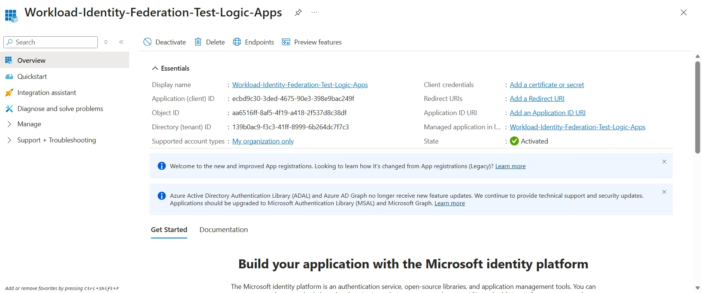
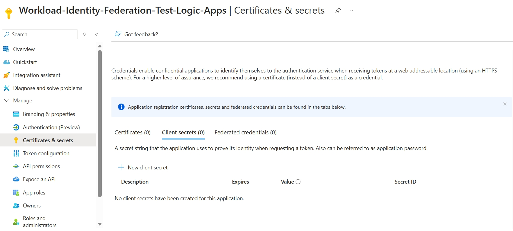
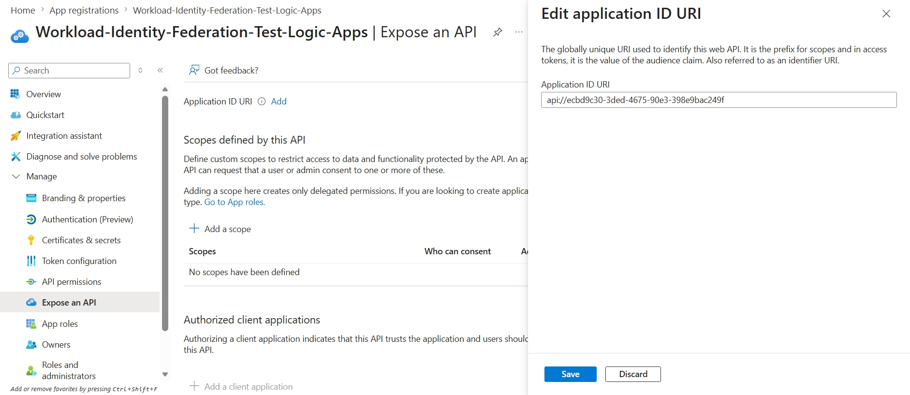
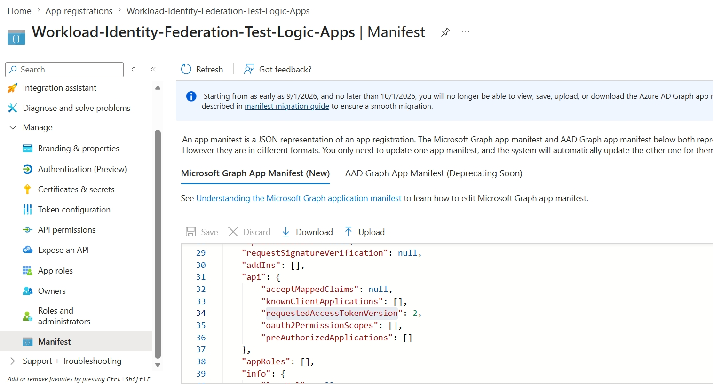

# Overview

This documentation focuses on the setup related to Workload Identity Federation authentication method.

Workload Identity Federation is a way for applications/services to authenticate to cloud resources without using stored secrets (client_secret, certificates, API keys).

Currently we support two different RFCs :

- [RFC-7523](https://www.rfc-editor.org/info/rfc7523/) - Default RFC.
- [RFC-8693](https://www.rfc-editor.org/rfc/rfc8693.html) - currently eligible only for Google based applications.

## Disclaimer
[RFC-8693](https://www.rfc-editor.org/rfc/rfc8693.html) is currently implemented for only Google based applications. Please use [RFC-7523](https://www.rfc-editor.org/info/rfc7523/) for default scenarios.

## Prerequisites

Before following the steps in this document, complete the setup in [SetupLogicApp-Standard-Agent](https://github.com/AzureAD/SCIMReferenceCode/blob/master/Microsoft.SCIM.LogicAppValidationTemplate/StandardLogicApp/SetupLogicApp-Standard-Agent.md) **up to (but not including)** the [`Run: Steps to Run Logic app`](https://github.com/AzureAD/SCIMReferenceCode/blob/master/Microsoft.SCIM.LogicAppValidationTemplate/StandardLogicApp/SetupLogicApp-Standard-Agent.md#run-steps-to-run-logic-app) section. The Workload Identity Federation setup described here is performed in place of (or in addition to) the credential setup in that flow, and the Logic App is then run as described in the parent document.

## Terminology

| Term | Meaning |
| --- | --- |
| ISV | Independent Software Vendor — the third-party SaaS application whose SCIM endpoint is being provisioned to (e.g., the application being onboarded to the Microsoft Entra app gallery). |
| WIF | Workload Identity Federation — an authentication pattern that allows a workload to obtain access tokens by presenting a signed assertion instead of a stored client secret. |
| JWT bearer assertion | A signed JSON Web Token presented to the ISV's token endpoint to prove the caller's identity, per [RFC-7523](https://www.rfc-editor.org/info/rfc7523/). |
| JWKS URI | JSON Web Key Set URI — the public endpoint the ISV uses to fetch the keys needed to validate the JWT signature. |
| `iss` / `sub` / `aud` claims | Standard JWT claims identifying the token's issuer, subject, and intended audience respectively. |
| Internal auth app | The Microsoft Entra ID application registration created in the [Setup on Microsoft Entra Id](#setup-on-microsoft-entra-id) section. The Logic App authenticates as this app to obtain the JWT assertion presented to the ISV. |

## Attributes supported

Although new attributes can be added in logic app, below list are the current attributes supported for the Workload Identity Federation authentication method :

| Attribute Name | Description | RFC methods | Required |
| --- | --- | --- | --- |
| `federatedClientId` | The client identifier of the trusted issuer used to sign and present the JWT bearer assertion to the authorization server per RFC-7523. | RFC-7523 | Required for ISVs |
| `federatedTokenEndpoint` | The authorization server's token endpoint that is called to exchange the assertion for an access token. | RFC-7523, RFC-8693 | Required for all |
| `federatedBaseAddress` | The base URL of the target SCIM API that is called with the issued access token to retrieve user or group information. | RFC-7523 | Required for ISVs |
| `federatedApplicationId` | The client ID of the new application registered in Entra ID Enterprise Applications (created in the steps below) to enable the end-to-end workload identity flow. | RFC-7523, RFC-8693 | Required for all |
| `federatedApplicationClientSecret` | The client secret of the new application registered in Entra ID Enterprise Applications (created in the steps below) to enable the end-to-end workload identity flow. | RFC-7523, RFC-8693 | Required for all |
| `federatedAudience` | The audience value required by Google's token exchange flow to scope the issued access token to the intended resource. | RFC-8693 | Required for Google |

## Setup

This section covers the setup needed for Workload Identity Federation authentication method to work with [SetupLogicApp-Standard-Agent](https://github.com/AzureAD/SCIMReferenceCode/blob/master/Microsoft.SCIM.LogicAppValidationTemplate/StandardLogicApp/SetupLogicApp-Standard-Agent.md).

This requires us to cover Microsoft EntraId setup alongwith the setup on the ISV portal to allow for this to work end to end.

### Setup on Microsoft Entra Id

> **What this section sets up:** the **internal auth app** — a Microsoft Entra ID application registration that the Logic App will authenticate as. The client secret created here is used by the Logic App **internally** to sign in and produce the JWT assertion that is then presented to the ISV. The actual federation trust between Entra ID and the ISV is established in the [Setup on ISV](#setup-on-isv) section below.

To allow for the tests to run end to end, we need to setup a new application in the Enterprise applications. This requires us to do the following :

- Go to **App Registrations** on the logic application tenant, and select + New registrations.

- Once selected, it will open a new window. Enter the name of the new application under Name section and click Register.

- This will open a new screen with the application information. Please note the ApplicationId here. This maps to the federatedApplicationId as one of the input parameters.

- Once this is done, go to Manage -> Certificates & secrets section. Here select Client secrets option and select `+ New client secret`. Note the client secret as this is shown only once and we would need this value later to map to federatedApplicationClientSecret.

- Now we need to set the application url to allow for this to be accessible.
    - Go to Expose an API section.
    - Click Add next to the Application ID URL.
    - This will open a side panel with the Application ID URL populated. Click Save if this looks good.
    
- Now we can go to Manifest and under Microsoft Graph App Manifest (New), update requestedAccessTokenVersion to 2.

This completes the Entra Side setup for the application. Below section covers how this information can be used to setup on the ISV end.

### Setup on ISV

> **What this section sets up:** the **Workload Identity Federation trust** on the ISV side. This is where the ISV is configured to trust JWT assertions issued by the internal auth app created above — no shared secret is exchanged with the ISV. The ISV validates incoming tokens by fetching Entra ID's public keys from the JWKS URI and checking the `iss`, `sub`, and `aud` claims against the values configured here.

Every ISV has their own setup, and the exact UI and field names differ from vendor to vendor. The table below lists the values most ISVs require and shows where to find each one on the Entra side. The configuration steps on the ISV portal itself are owned by the ISV — refer to their documentation for the precise navigation.

Note : The list below is not comprehensive but covers the parameters most commonly requested by ISVs. Documentation for ISV-side configuration is not maintained here as it varies per vendor.

| Attribute on ISV | Attribute on Entra side | Location on Entra |
| --- | --- | --- |
| Token Issuer (`iss` claim) | `https://login.microsoftonline.com/<tenantId>` | `tenantId` is found at **App registrations** → app created in [Setup on Microsoft Entra Id](#setup-on-microsoft-entra-id) → **Essentials** → **Directory (tenant) ID**. |
| JWKS URI | `https://login.windows.net/<tenantId>/discovery/v2.0/keys` | `tenantId` is found at **App registrations** → app created in [Setup on Microsoft Entra Id](#setup-on-microsoft-entra-id) → **Essentials** → **Directory (tenant) ID**. |
| Subject (`sub` claim) | Object ID | **App registrations** → app created in [Setup on Microsoft Entra Id](#setup-on-microsoft-entra-id) → **Essentials** → select **Managed application in local directory** → copy **Object ID** from the page that loads. |
| Audience (`aud` claim) | Application ID | **App registrations** → app created in [Setup on Microsoft Entra Id](#setup-on-microsoft-entra-id) → **Essentials** → **Application (client) ID**. |

## Conclusion

This wraps up the setup required for Workload Identity authentication. Please feel free to go back to [SetupLogicApp-Standard-Agent](https://github.com/AzureAD/SCIMReferenceCode/blob/master/Microsoft.SCIM.LogicAppValidationTemplate/StandardLogicApp/SetupLogicApp-Standard-Agent.md).